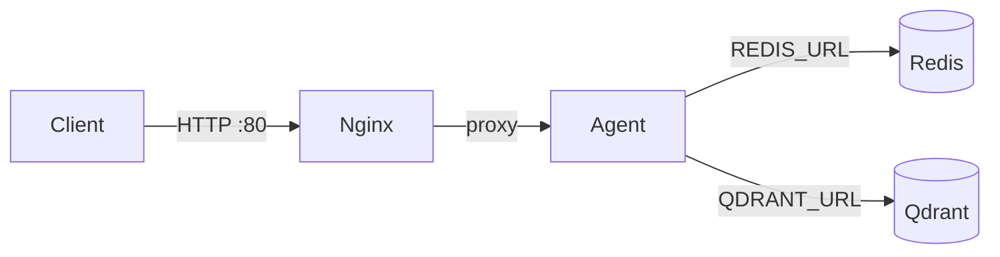

# Day 12 — Delivery Checklist (Completed)

> **Student Name:** Nguyen Duc Anh  
> **Student ID:** 2A202600146  
> **Date:** 17/04/2026  

---

## 1. Mission Answers (aligned with `REPORT_NOTES.md`)

### Part 1: Localhost vs Production

#### Exercise 1.1: Anti-patterns found (≥ 5)

1. API key hardcoded in application code.  
2. Fixed port binding without configuration from the environment.  
3. Debug / auto-reload enabled in a way that is unsafe for production.  
4. No `/health` (or similar) endpoint for orchestration probes.  
5. No graceful shutdown handling for SIGTERM-style stops.

#### Exercise 1.3: Comparison table (develop vs production)

| Feature | Basic (develop) | Advanced (production) | Why it matters |
|---------|------------------|------------------------|----------------|
| Config | Hardcoded values | Environment variables | Same artifact can run in dev/staging/prod safely (12-factor). |
| Health check | Missing | `/health` (+ `/ready` where implemented) | Platforms need probes to restart unhealthy instances and gate traffic. |
| Logging | `print()` | Structured JSON logging | Easier search, monitoring, and lower risk of leaking secrets in free-form prints. |
| Shutdown | Abrupt stop | Graceful (lifespan / SIGTERM) | Reduces dropped in-flight requests during deploys and scaling events. |

---

### Part 2: Docker

#### Exercise 2.1: Dockerfile (develop) — answers

1. **Base image:** `python:3.11`  
2. **Working directory:** `/app` (`WORKDIR /app`)  
3. **Why `COPY requirements.txt` first:** Better layer caching; dependency layer only rebuilds when requirements change.  
4. **CMD vs ENTRYPOINT:** `CMD` is the default command/args and is easy to override at `docker run`; `ENTRYPOINT` fixes the main executable and is harder to override without `--entrypoint`.

#### Exercise 2.3: Image size comparison

| Image | Size |
|-------|------|
| `my-agent:develop` | 1.66 GB |
| `my-agent:advanced` | 236 MB |

**Difference:** Advanced image is much smaller because the runtime stage drops build toolchains and caches; only runtime Python, installed packages, and app code remain.

#### Exercise 2.4: Docker Compose stack

**Services:** `nginx` (reverse proxy, host `80:80`), `agent` (FastAPI, internal), `redis`, `qdrant`.  

**Communication:** Client → `nginx:80` → `agent:8000`; agent uses `REDIS_URL` → `redis:6379`; agent uses `QDRANT_URL` → `qdrant:6333`.

**Architecture (mermaid):**



**Result:** `/health` returned **200**; `/ask` returned **200** (after `docker compose up -d --build` in `02-docker/production`).

---

### Part 3: Cloud Deployment

#### Exercise 3.1: Railway deployment

- **Public URL (evidence):** `https://sweet-heart-production-442e.up.railway.app`  
- **Dashboard screenshot:** [screenshots/railway.png](screenshots/railway.png) — project **sweet-heart**, environment **production**, status online / building as captured.  
- **Live response screenshot:** [screenshots/success.png](screenshots/success.png) — root JSON confirms service reachable on Railway.

---

### Part 4: API Security

#### Exercises 4.1–4.3: Summary + tests (from lab folders)

**4.1 — API key (`04-api-gateway/develop`)**

- Key checked in `verify_api_key` via `APIKeyHeader("X-API-Key")` and `Depends` on `/ask`.  
- Missing key → **401**; wrong key → **403** in that exercise app.  
- **Rotate key:** change `AGENT_API_KEY` in the environment and restart the process.

**4.3 — Rate limiting (`04-api-gateway/production`)**

- **Algorithm:** Sliding window counter (timestamp deque per user, 60 s window).  
- **Limits:** user **10 req/min**; admin **100 req/min**.  
- **Admin bypass:** role-based selection of limiter in `app.py` (`admin` vs default).

#### Exercise 4.4: Cost guard

- Implemented `check_budget(user_id, estimated_cost) -> bool` with **$10 / user / calendar month**, Redis-backed spend keyed by `YYYY-MM`, with TTL so keys expire after the month window.

---

### Part 5: Scaling & Reliability

| Exercise | Result (from `REPORT_NOTES.md`) |
|----------|----------------------------------|
| 5.1 Health | `/health` and `/ready` returned **200** where implemented. |
| 5.2 Graceful shutdown | After `SIGTERM`, in-flight `/ask` still completed with **200**. |
| 5.3 Stateless | Session/history stored in Redis when `REDIS_URL` points to Redis (not in-process only). |
| 5.4 Load balancing | `X-Served-By` showed **3 distinct upstreams** when scaling agent behind Nginx. |
| 5.5 Stateless test | `test_stateless.py` passed; history consistent across instances. |

---

## 2. Full Source Code — Lab 06 / Final agent

**Repository:** `https://github.com/NDAismeee/Lab12-Nguyen_Duc_Anh-2A202600146`  

**Final production agent path (actual layout):**

```text
my-production-agent/
├── app/
│   ├── main.py
│   ├── config.py
│   ├── auth.py
│   ├── rate_limiter.py
│   ├── cost_guard.py
│   ├── mock_llm.py
│   ├── history_store.py
│   ├── history_api.py
│   ├── redis_client.py
│   ├── openai_chat.py
│   └── logging_utils.py
├── Dockerfile
├── docker-compose.yml
├── requirements.txt
├── .env.example
├── .dockerignore
├── railway.toml
├── nginx/nginx.conf
└── README.md
```

**Course template** listed `utils/mock_llm.py`; this repo uses `app/mock_llm.py` under `my-production-agent/` (functionally equivalent).

**Automated readiness (06-lab-complete):** [screenshots/06-complete.png](screenshots/06-complete.png) — `check_production_ready.py`: **20/20** checks passed (**100%**), including Dockerfile, compose, `.dockerignore`, `.env.example`, `railway.toml`, security checks, `/health` + `/ready`, auth, rate limit, SIGTERM, JSON logging, multi-stage Docker, non-root user, HEALTHCHECK, slim base.

**Functional requirements (final agent):** REST `/ask`, Redis-backed history, API key auth, rate limit (default **10/min** via settings), monthly cost guard (**$10** default), `/health` + `/ready`, SIGTERM handling, structured JSON logging, multi-stage Docker, Nginx + scalable `agent` in compose.

---

## 3. Deployment Information (for `DEPLOYMENT.md` parity)

### Public URL

`https://sweet-heart-production-442e.up.railway.app`

### Platform

Railway (`up.railway.app`)

### Test commands

**Health**

```bash
curl https://sweet-heart-production-442e.up.railway.app/health
```

**Readiness**

```bash
curl https://sweet-heart-production-442e.up.railway.app/ready
```

**API (production agent uses JSON body `question` + header `X-API-Key`)**

```bash
curl -X POST "https://sweet-heart-production-442e.up.railway.app/ask" \
  -H "X-API-Key: YOUR_KEY" \
  -H "Content-Type: application/json" \
  -d "{\"question\":\"Hello\"}"
```

### Environment variables (set on Railway / local template)

- `PORT` (set by Railway)  
- `REDIS_URL`  
- `AGENT_API_KEYS` or `AGENT_API_KEY`  
- `LOG_LEVEL` (optional)  
- `OPENAI_API_KEY` / `OPENAI_MODEL` (optional; empty key → mock LLM in `my-production-agent`)

### Screenshots (repo)

- [screenshots/railway.png](screenshots/railway.png) — Railway dashboard  
- [screenshots/success.png](screenshots/success.png) — public URL JSON response  
- [screenshots/06-complete.png](screenshots/06-complete.png) — `check_production_ready.py` 20/20  

---

## 4. Pre-submission checklist

- [x] Repository URL identified: `https://github.com/NDAismeee/Lab12-Nguyen_Duc_Anh-2A202600146` (confirm **public** or instructor access before deadline)  
- [x] Mission-style answers recorded above (same substance as required for `MISSION_ANSWERS.md`; duplicate into that filename if the grader requires the exact filename)  
- [x] Working public URL documented: `https://sweet-heart-production-442e.up.railway.app`  
- [x] Source under `my-production-agent/app/` (+ supporting files)  
- [x] `my-production-agent/README.md` includes local and Docker instructions  
- [x] `.env` not required in repo; `.env.example` present under `my-production-agent/`  
- [x] No hardcoded secrets in checked paths per `check_production_ready`  
- [x] Public URL evidenced in `screenshots/success.png`  
- [x] Screenshots in `screenshots/`  
- [x] Commit history: maintained in git (routine commits expected)  

---

## 5. Self-test (production URL)

Replace `YOUR_KEY` with a key allowed by your Railway variables.

```bash
curl https://sweet-heart-production-442e.up.railway.app/health

curl -i -X POST https://sweet-heart-production-442e.up.railway.app/ask \
  -H "Content-Type: application/json" \
  -d "{\"question\":\"Hello\"}"
# Expect 401 without X-API-Key

curl -i -X POST https://sweet-heart-production-442e.up.railway.app/ask \
  -H "X-API-Key: YOUR_KEY" \
  -H "Content-Type: application/json" \
  -d "{\"question\":\"Hello\"}"
# Expect 200 with valid key
```

---

## 6. Submission

**GitHub repository URL**

`https://github.com/NDAismeee/Lab12-Nguyen_Duc_Anh-2A202600146`

**Deadline (from course checklist):** 17/4/2026  

---
