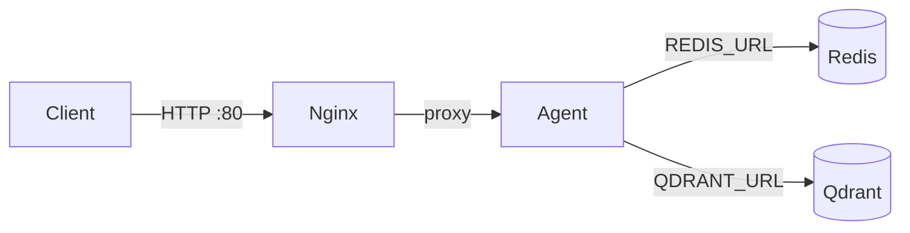

# Report Notes (CODE_LAB requirements only)

This file only records what `CODE_LAB.md` explicitly asks for (tasks + required outputs). Keep entries short so it’s easy to extend later.

---

## Task Log

### Task 1 — Exercise 1.1: Find anti-patterns

- **Source**: `CODE_LAB.md` → Part 1 → Exercise 1.1
- **Target file**: `01-localhost-vs-production/develop/app.py`
- **Requirement**: find **at least 5** issues (anti-patterns).

#### Findings (≥ 5)

1. **API key hardcode**
2. **Port cố định**
3. **Debug mode / reload bật**
4. **Không có health check**
5. **Không xử lý shutdown (graceful shutdown)**

#### Evidence (optional)

- File contains hardcoded key, fixed host/port, `reload=True`, no `/health`, no shutdown handler.

---

### Task 2 — Exercise 1.2: Run basic version + test request

- **Source**: `CODE_LAB.md` → Part 1 → Exercise 1.2
- **Target folder**: `01-localhost-vs-production/develop`
- **Requirement**: run the app and test the `/ask` endpoint.

#### Commands run

```powershell
python app.py
curl.exe -X POST "http://localhost:8000/ask?question=Hello"
```

#### Output (expected)

- **HTTP 200** and JSON response with an `answer` field.

---

### Task 3 — Exercise 1.3: Compare basic vs advanced version

- **Source**: `CODE_LAB.md` → Part 1 → Exercise 1.3
- **Requirement**: compare `develop/app.py` vs `production/app.py` and fill the table.

| Feature | Basic (develop) | Advanced (production) | Why it matters |
|---|---|---|---|
| Config | Hardcode | Env vars | Same code can run in dev/staging/prod safely (12-factor). |
| Health check | Missing | `/health` (+ `/ready`) | Platforms need health/readiness probes to restart and route traffic correctly. |
| Logging | `print()` | Structured JSON logging | Searchable/parsable logs for debugging and monitoring; easier to avoid leaking secrets. |
| Shutdown | Abrupt | Graceful (lifespan + SIGTERM handler) | Avoid dropping in-flight requests during deploy/scale/stop. |

---

### Task 4 — Exercise 2.1: Dockerfile cơ bản (read + answer)

- **Source**: `CODE_LAB.md` → Part 2 → Exercise 2.1
- **Target file**: `02-docker/develop/Dockerfile`
- **Requirement**: read `Dockerfile` and answer questions.

1. **Base image là gì?**
   - `python:3.11`
2. **Working directory là gì?**
   - `/app` (set by `WORKDIR /app`)
3. **Tại sao COPY `requirements.txt` trước?**
   - To leverage Docker layer caching: dependencies only reinstall when `requirements.txt` changes, speeding up rebuilds.
4. **CMD vs ENTRYPOINT khác nhau thế nào?**
   - `CMD`: default command/args, easily overridden at `docker run ...`.
   - `ENTRYPOINT`: the fixed executable for the container; arguments can be appended, harder to override unless `--entrypoint` is used.

---

### Task 5 — Exercise 2.2: Build và run

- **Source**: `CODE_LAB.md` → Part 2 → Exercise 2.2
- **Requirement**: build image, run container, test endpoint, observe image size.

#### Commands run

```powershell
docker build -f 02-docker/develop/Dockerfile -t my-agent:develop .
docker run -p 8000:8000 my-agent:develop
```

Test (PowerShell):

```powershell
curl.exe -X POST "http://localhost:8000/ask?question=What%20is%20Docker%3F"
```

Image size:

```powershell
docker images my-agent:develop
```

#### Result

- **Image size**: `1.66GB`

---

### Task 6 — Exercise 2.3: Multi-stage build

- **Source**: `CODE_LAB.md` → Part 2 → Exercise 2.3
- **Target file**: `02-docker/production/Dockerfile`
- **Requirement**: read `Dockerfile` and find stage roles + why image smaller; build and compare.

1. **Stage 1 làm gì?**
   - `builder`: install build tools (e.g. `gcc`, `libpq-dev`) and install Python dependencies into `/root/.local`.
2. **Stage 2 làm gì?**
   - `runtime`: create non-root user, copy only installed packages (`/root/.local`) + app source, then run with `uvicorn`.
3. **Tại sao image nhỏ hơn?**
   - Runtime stage excludes build tooling and apt caches; only keeps runtime Python + installed site-packages + source code.

Build & compare:

```powershell
docker build -f 02-docker/production/Dockerfile -t my-agent:advanced .
docker images my-agent:develop
docker images my-agent:advanced
```

#### Result

- **my-agent:develop**: `1.66GB`
- **my-agent:advanced**: `236MB`

---

### Task 7 — Exercise 2.4: Docker Compose stack

- **Source**: `CODE_LAB.md` → Part 2 → Exercise 2.4
- **Target file**: `02-docker/production/docker-compose.yml`
- **Requirement**: read compose file, draw architecture diagram, run `docker compose up`, answer which services start + how they communicate, and test endpoints.

#### Services started

- `nginx` (reverse proxy / load balancer) — exposes `80:80` to host
- `agent` (FastAPI app) — internal only (not published)
- `redis` (cache / rate limiting)
- `qdrant` (vector DB)

#### Communication

- Client → `nginx:80` → upstream `agent:8000`
- `agent` → `redis:6379` (via `REDIS_URL=redis://redis:6379/0`)
- `agent` → `qdrant:6333` (via `QDRANT_URL=http://qdrant:6333`)

#### Architecture diagram



#### Commands run

```powershell
cd 02-docker/production
docker compose up -d --build
```

Test (PowerShell):

```powershell
curl.exe "http://localhost/health"
curl.exe -X POST "http://localhost/ask" -H "Content-Type: application/json" -d "{\"question\":\"Explain microservices\"}"
```

Stop:

```powershell
docker compose down
```

#### Result

- `/health` returned **200**
- `/ask` returned **200**

---

### Task 8 — Exercise 4.1: API Key authentication

- **Source**: `CODE_LAB.md` → Part 4 → Exercise 4.1
- **Target file**: `04-api-gateway/develop/app.py`
- **Requirement**: read `app.py` and answer questions (where key checked, what if wrong key, how to rotate); test endpoints.

1. **API key được check ở đâu?**
   - In dependency `verify_api_key(...)` using `APIKeyHeader(name="X-API-Key")`, injected into `/ask` via `Depends(verify_api_key)`.
2. **Điều gì xảy ra nếu sai key?**
   - Missing key → **401** (`"Missing API key..."`)
   - Wrong key → **403** (`"Invalid API key."`)
3. **Làm sao rotate key?**
   - Change the environment variable `AGENT_API_KEY` (and restart the service). Old key stops working immediately after restart.

Test (PowerShell):

```powershell
cd 04-api-gateway/develop
$env:AGENT_API_KEY="secret-key-123"
python app.py

# No key -> 401
curl.exe -X POST "http://localhost:8000/ask?question=Hello"

# With key -> 200
curl.exe -X POST "http://localhost:8000/ask?question=Hello" -H "X-API-Key: secret-key-123"
```

---

### Task 9 — Exercise 4.3: Rate limiting

- **Source**: `CODE_LAB.md` → Part 4 → Exercise 4.3
- **Target file**: `04-api-gateway/production/rate_limiter.py`
- **Requirement**: read `rate_limiter.py` and answer questions; test by sending many requests.

1. **Algorithm nào được dùng?**
   - Sliding Window Counter (timestamps deque per user, window \(60s\)).
2. **Limit là bao nhiêu requests/minute?**
   - User: **10 req/min** (`rate_limiter_user = RateLimiter(max_requests=10, window_seconds=60)`)
   - Admin: **100 req/min** (`rate_limiter_admin = RateLimiter(max_requests=100, window_seconds=60)`)
3. **Làm sao bypass limit cho admin?**
   - In `04-api-gateway/production/app.py`, limiter is selected by role:
     - `admin` → `rate_limiter_admin`
     - otherwise → `rate_limiter_user`

Test (PowerShell) (requires JWT token from `/auth/token`):

```powershell
cd 04-api-gateway/production
python app.py

# Get token
$token = (Invoke-RestMethod -Method Post -Uri "http://localhost:8000/auth/token" `
  -ContentType "application/json" `
  -Body '{"username":"student","password":"demo123"}').access_token

# Spam 20 requests (should hit 429 after limit)
for ($i=1; $i -le 20; $i++) {
  try {
    Invoke-RestMethod -Method Post -Uri "http://localhost:8000/ask" `
      -Headers @{ Authorization = "Bearer $token" } `
      -ContentType "application/json" `
      -Body ("{""question"":""Test $i""}")
    "OK $i"
  } catch {
    "ERR $i: $($_.Exception.Message)"
  }
}
```

---

### Task 10 — Exercise 4.4: Cost guard

- **Source**: `CODE_LAB.md` → Part 4 → Exercise 4.4
- **Target file**: `04-api-gateway/production/cost_guard.py`
- **Requirement**: implement budget check logic.

Implemented function:

- `check_budget(user_id: str, estimated_cost: float) -> bool`
  - monthly budget: **$10/user/month**
  - reset when month changes (key \(YYYY-MM\))

---

## Part 5 — Scaling & Reliability (results)

### Task 11 — Exercise 5.1: Health checks

- **Source**: `CODE_LAB.md` → Part 5 → Exercise 5.1
- **Target file**: `05-scaling-reliability/develop/app.py`
- **Requirement**: implement `/health` and `/ready`.

Result:

- `/health` returned **200**
- `/ready` returned **200**

### Task 12 — Exercise 5.2: Graceful shutdown

- **Source**: `CODE_LAB.md` → Part 5 → Exercise 5.2
- **Target file**: `05-scaling-reliability/develop/app.py`
- **Requirement**: handle SIGTERM and allow in-flight requests to finish.

Result:

- Sent `SIGTERM` after server logged `POST /ask?...` and the request still returned **200**.

### Task 13 — Exercise 5.3: Stateless design

- **Source**: `CODE_LAB.md` → Part 5 → Exercise 5.3
- **Target file**: `05-scaling-reliability/production/app.py`
- **Requirement**: stateless design (state in Redis, not in-memory).

Result:

- Session/history stored via Redis (`REDIS_URL=redis://redis:6379/0`) when Redis available.

### Task 14 — Exercise 5.4: Load balancing

- **Source**: `CODE_LAB.md` → Part 5 → Exercise 5.4
- **Target file**: `05-scaling-reliability/production/docker-compose.yml`
- **Requirement**: run stack with Nginx LB and scale agent to 3; observe distribution.

Result:

- `X-Served-By` header observed **3 unique upstreams** during repeated `/health` calls.

### Task 15 — Exercise 5.5: Test stateless

- **Source**: `CODE_LAB.md` → Part 5 → Exercise 5.5
- **Target file**: `05-scaling-reliability/production/test_stateless.py`
- **Requirement**: run `python test_stateless.py` and verify session preserved across instances.

Result:

- `test_stateless.py` completed successfully.
- Requests were served by **multiple instances** and conversation history count matched expected messages.

